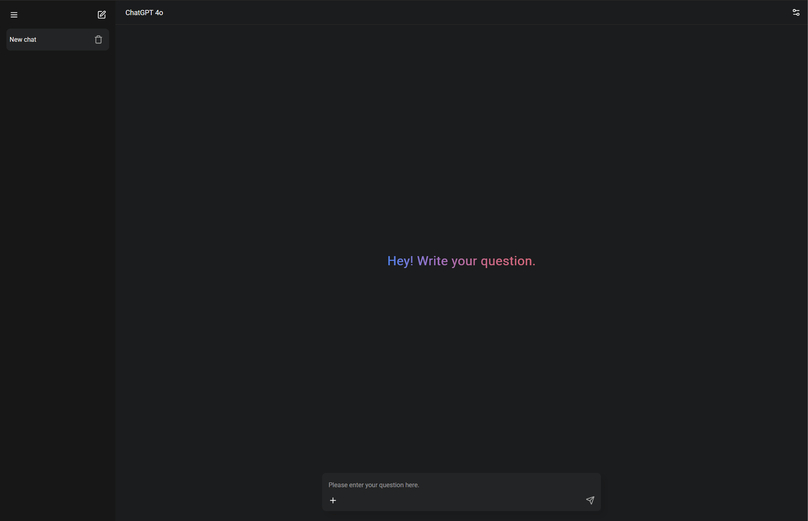

# 🧠 BebraAI — AI-помощник в вашем браузере

**BebraAI** — это лёгкое и удобное open-source веб-приложение, разработанное на **React**, предоставляющее доступ к возможностям **ChatGPT** прямо из браузера. Интерфейс прост, интуитивен и полностью адаптивен. Подходит как для повседневного использования, так и для встраивания в более крупные проекты.



---

## 🚀 Особенности

- 🔥 Использует OpenAI ChatGPT API и не только (через `g4f`)
- 🌍 Мультиязычный интерфейс с автоопределением языка (`i18next`, `react-i18next`, `i18next-browser-languagedetector`)
- 💬 Поддержка Markdown + формул (KaTeX, React Markdown)
- 💾 Сохраняет историю диалогов
- 📱 Полностью адаптивен (десктоп и мобильные устройства)

---

## ⚙️ Установка и запуск

```bash
git clone https://github.com/Homanti/bebraai.git
cd BebraAI
npm install
npm run dev
```

---

## 🧩 Основные зависимости

- **[React](https://reactjs.org/)** — библиотека для построения пользовательских интерфейсов
- **[Vite](https://vitejs.dev/)** — современный сборщик и dev-сервер
- **[zustand](https://github.com/pmndrs/zustand)** — легковесный менеджер состояния
- **[react-i18next](https://react.i18next.com/)** + **i18next-browser-languagedetector** — мультиязычность
- **[react-router-dom](https://reactrouter.com/)** — маршрутизация
- **[motion](https://motion.dev/)** — анимации
- **[lucide-react](https://lucide.dev/)** — SVG-иконки
- **[react-markdown](https://github.com/remarkjs/react-markdown)**, **remark-math**, **rehype-katex** — Markdown + математическая разметка
- **[g4f](https://github.com/xtekky/gpt4free)** — библиотека для обхода платного API OpenAI

---

## 🤝 Вклад

Pull Requests приветствуются!  
Если вы нашли баг или у вас есть идея для улучшения — создайте issue или отправьте PR.

---

## 📜 Лицензия

Этот проект распространяется под лицензией **MIT** — свободно используйте, модифицируйте и распространяйте.

---

## 💬 Контакты

- Telegram: [@homanti](https://t.me/homanti)
- Element: https://elemsocial.com/e/Homanti
